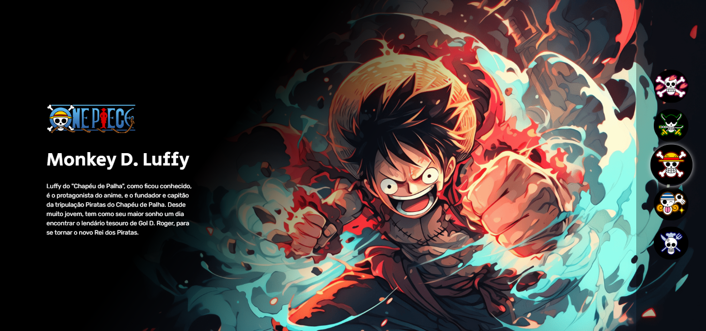

<h1 align="center"> One Piece - Project☠️</h1>

Projeto realizado na maratona Dev em Dobro.

  <a href="#-tecnologias">Tecnologias</a>&nbsp;&nbsp;&nbsp;|&nbsp;&nbsp;&nbsp;
  <a href="#-projeto">Projeto</a>&nbsp;&nbsp;&nbsp;|&nbsp;&nbsp;&nbsp;
  <a href="#-layout">Layout</a>&nbsp;&nbsp;&nbsp;|&nbsp;&nbsp;&nbsp;
  <a href="#memo-licença">Licença</a>

  

 

  

## 🚀 Tecnologias

Esse projeto foi desenvolvido com as seguintes tecnologias:

- HTML e CSS
- JavaScript
- Git e Github

## 💻 Projeto

O projeto One Piece agrupa curiosidades, características, imagens e descrições sobre os principais personagens do mangá, que recebeu uma série live action recentemente e é caracterizado como uma febre mundial nos seriados de mangá.

## :memo: Licença

Esse projeto está sob a licença MIT.

---

Feito com ♥ by Guilherme A. Gongora :wave:
